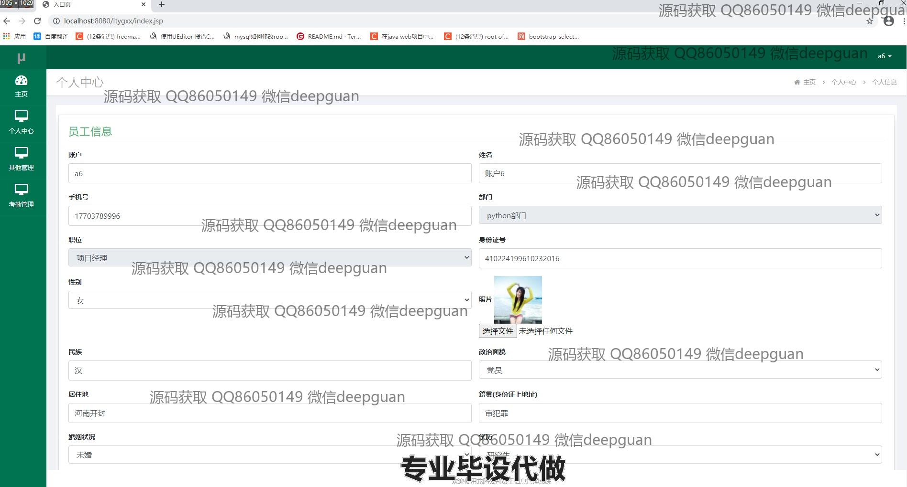
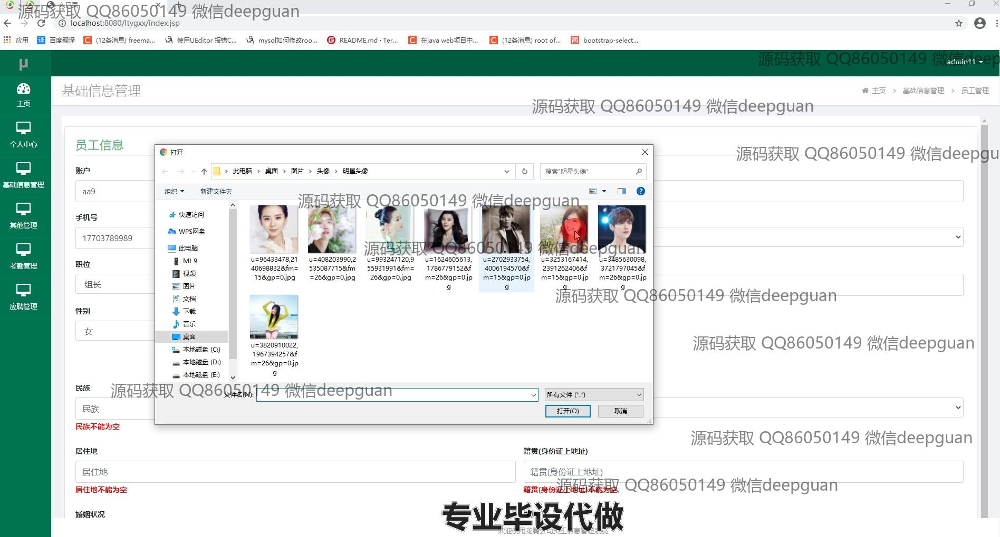

<h1 align="center">基于JavaEE的龙腾公司员工信息管理系统的设计与实现</h1>

## 简介
龙腾公司员工信息管理系统：角色分为管理员、用户；功能包括员工信息录入、查询、修改、删除，应聘和考勤管理，支持批量处理，提高人力资源管理效率。    --计算机毕业设计源码；毕设源码；java毕业设计源码

## 联系方式

<h3 align="center">获取完整代码与数据库文件 + 微信：deepguan QQ: 86050149 QQ群: 783742310</h3>

<h3 align="center">可帮忙远程部署 包运行成功！提供远程部署、修改代码、设计文档指导、代码讲解等服务！</h3>

## 功能介绍（完整见运行截图）
管理员：员工信息管理：录入、修改、查询和删除员工信息，支持批量操作。部门和职位管理：添加、查看、修改和删除部门及职位信息。考勤管理：记录员工请假、上下班打卡信息，并对考勤记录进行查询和管理。面试和应聘管理：录入、修改和查询应聘者信息，安排面试时间并记录面试结果。培训和薪资管理：跟踪员工培训记录和管理员工薪资信息。系统配置：导航栏配置和用户权限设置，保证系统安全性和数据准确性。

用户：个人信息管理：查看和更新个人基本信息，如姓名、手机号、部门和职位。考勤功能：查看个人考勤记录，进行上下班打卡，并能提交请假申请和查看审批结果。面试和培训：查看安排的面试时间和培训课程，以及培训内容和结果。员工互动：在系统内与管理员沟通，反馈信息并获取公司最新政策和通知。访问限制：基于角色的访问权限限制，仅可操作相关模块，提高操作安全性。

## 运行截图

本代码来源于网络,仅供学习参考使用!

